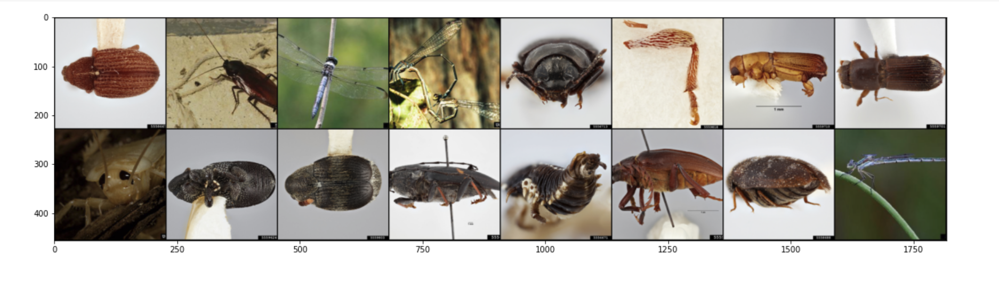
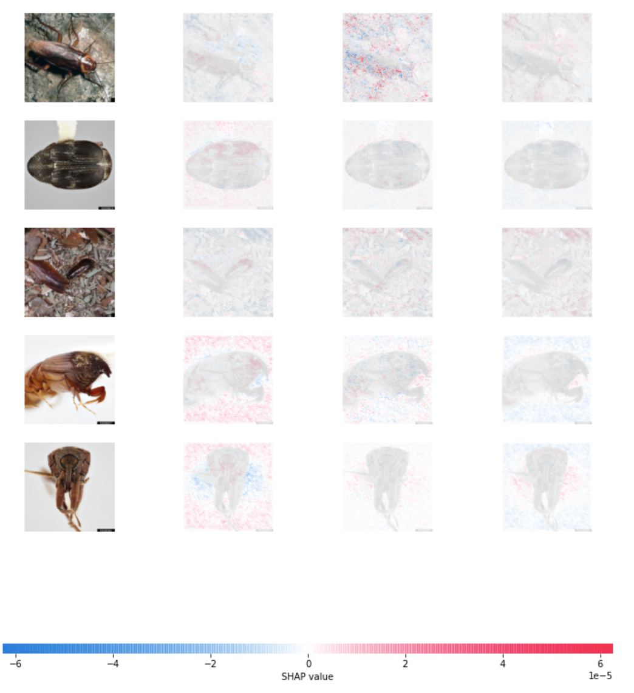

# Building A Convolutional Neural Network with Pytorch

Convolutional neural networks (CNN) are a type of deep learning model that is widely applied in many areas such as computer vision and natural language processing. A typical CNN model used in image classification takes an image as the input. It then applies many layers of convolutions on the input in order to capture important characteristics of the input image. These convolved outputs are then fed into one or two fully connected layers to make the final classification. CNN models are advantageous compared to other models for image classifications because the model can learn important features automatically, avoiding the need to hand-engineer features. CNN model also produces excellent model performance. However, one drawback of CNN models is that, similar to most deep learning models, CNN is considered a black-box model -- it is unclear to humans how the model makes a particular prediction for a particular data point. Explainable machine learning is gaining more attention that attempts to explain how does a black-box model make a certain prediction. One such method is Shapley values -- a concept based on Game Theory that quantifies the contribution of a single player in a game. 

This repository demonstrates how to build a vanilla CNN model for classifying the types of insects on an image. The training data used can be found [here](https://www.insectimages.org/index.cfm). It also demonstrates a simple application of explainable machine learning using the Python `SHAP` package. 

A sample of the training data

The model architecture is shown below:

|       Layer Type      |      Detail      |
|:---------------------:|:----------------:|
|  Convolutional Layer  |  Kernel size: 5  |
|   Max Pooling layer   |  Kernal size: 2  |
|    ReLU Activation    |                  |
|  Convolutional Layer  |  Kernel size: 3  |
|     Dropout Layer     |                  |
|   Max Pooling Layer   |  Kernel size: 2  |
|    ReLU Activation    |                  |
| Fully Connected Layer | Output size: 120 |
|    ReLU Activation    |                  |
|     Dropout Layer     |                  |
| Fully Connected Layer |  Output size: 3  |
|        Softmax        |                  |
|                       |                  |

The model is enable to reach 100% classification accuracy with 10 epoches of training.

Using [`SHAP`](https://github.com/slundberg/shap), we are able to approximate the Shapley values for deep learning models. In image classification tasks, pixels on the images are treated as features or players in Game Theory terminology. Shapley values are calculated for pixels and are visualized below. The higher the Shapley values means more contribution this feature made for the final prediction.

---
### Blog
For model detailed tutorial, please refer to my blog post [here](https://jiamanbettywu.github.io/post/insects-cnn/).